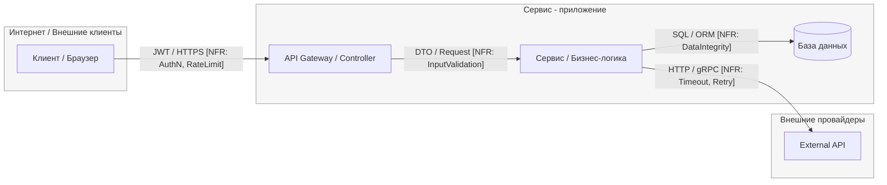

# S04 – DFD

```mermaid
flowchart LR
  %% --- Trust boundaries (по контурам) ---
  subgraph Internet[Интернет / Внешние клиенты]
    U[Клиент / Браузер]
  end

  subgraph Service[Сервис - приложение]
    A[API Gateway / Controller]
    S[Сервис / Бизнес-логика]
    D[(База данных)]
  end

  subgraph External[Внешние провайдеры]
    X[External API]
  end

  %% --- Потоки данных ---
  U -- "JWT / HTTPS [NFR: AuthN, RateLimit]" --> A
  A -->|"DTO / Request [NFR: InputValidation]"| S
  S -->|"SQL / ORM [NFR: DataIntegrity]"| D
  S -->|"HTTP / gRPC [NFR: Timeout, Retry]"| X

  %% --- Оформление границ ---
  classDef boundary fill:#f6f6f6,stroke:#999,stroke-width:1px;
  class Internet,Service,External boundary;

```
